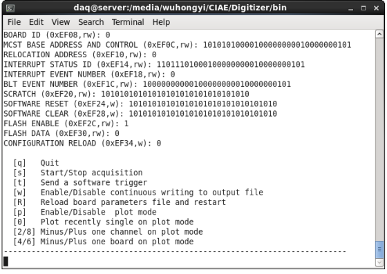
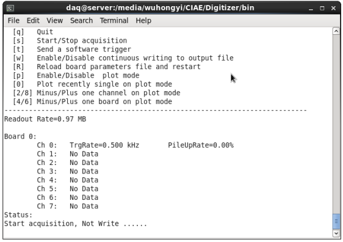
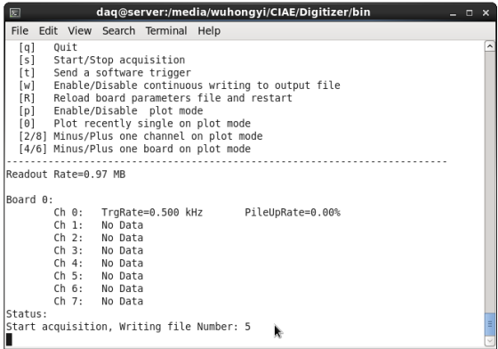

<!-- README.md --- 
;; 
;; Description: 
;; Author: Hongyi Wu(吴鸿毅)
;; Email: wuhongyi@qq.com 
;; Created: 日 4月 24 10:54:48 2016 (+0800)
;; Last-Updated: 六 4月 30 13:41:52 2016 (+0800)
;;           By: Hongyi Wu(吴鸿毅)
;;     Update #: 34
;; URL: http://wuhongyi.github.io -->

程序路径：

```
IP：222.29.111.59
user: daq
/home/daq/wuhongyi/Digitizer
```

# 关于运行

程序启动后，将会显示以下内容：



- 输入**q**退出程序。
- 输入**s**来切换启动/关闭获取。
- 输入**t**表示给一个外部触发信号。
- 输入**w**来切换是否写文本。
- 输入**R**重新读取获取参设。
- 输入**p**来切换是否打开图形监视波形。
- 输入数字**0**表示在监视界面画出监视路最近的一个波形。
- 输入数字**2，4，6，8**用来改变监视路。

获取开启，将会向**run.log**写入开始时间，获取关闭时也会写入结束时间。当开启写数据模式时，先读取**Log**文件夹下的**RunNumber**文件中的数值为当前的运行编号（用在数据文件命名），并使该数值加一保存。在**Log**文件夹下生成当前时刻命名的文件夹(例如20160424150912)，文件夹内复制保存当前获取所用输入卡。并将当前运行编号写进**run.log**.

开启写文本模式时候，获得当前运行编号N，第一次文件名为runN_0,文件大小达到 2 GB 自动保存，打开runN_1，依次类推。

```
run0001_0 run0001_1
run0125_0
run6241_0 run6241_1 run6241_2
```






# raw to ROOT

文件夹**analysis**内程序**raw2root.cc**用来将输出的二进制文件转成ROOT文件。

```cpp
char filepath[128] ="../data";
```

需要修改里面指向数据文件夹的路径。

具体运行：

```bash
make
./raw2root
```
会提示你输入需要转的文件最小编号跟最大编号。例如我要转文件编号0000到0120的文件，只需要输入0跟120即可。如果里面某些编号文件不存在会自动跳过。同一个运行标号的几个子文件会存在一个root文件中，例如**run0100_0,run0100_1,run0100_2**数据会转成**run0100.root**。

----

# 运行方式

```bash
cd build
cmake ..
make
cd ../bin
./pkuDigitizer
```

根据编译器版本不同（关键在于编译**ROOT**时候是否支持C++11，gcc4.9及以上），需要修改**CMakeLists.txt**以下内容：

```bash
##C99  ROOT不支持C++11采用以下两行
set(CMAKE_CXX_FLAGS " -fPIC -W -Wall -s")#
set(CMAKE_C_FLAGS " -fPIC -W -Wall -s")#
##C++11 ROOT支持C++11采用以下两行
set(CMAKE_CXX_FLAGS "-std=c++11  -fPIC -W -Wall -s")#
set(CMAKE_C_FLAGS "-std=c++11  -fPIC   -W -Wall -s")#
```

可能需要修改的全局变量:

在 DigitizerGlobal.hh 文件中，

```cpp
#define MAXNB_V1724  1   //定义使用的插件个数
#define CANVASX 800      //画版的长度
#define CANVASY 400      //画板的宽度
#define MAXFILEBYTE 2000000000  //byte 单文件大小超过这个数值就会自定保存关闭并开启下一个文件
static std::string PKU_DGTZ_GlobalParametersFileName = "GlobalParameters.txt";  //定义输入卡文件名称
static std::string PKU_DGTZ_BoardParametersFileName = "BoardParameters.txt";    //定义输入卡文件名称
```

在输入卡**GlobalParameters.txt**中

```bash
PathToRawData ../data
PlotChooseN 1000
```

**PathToRawData**后面填写数据文件存放文件夹路径。**PlotChooseN**后面填写监视路每多少个信号画一次。

在输入卡**BoardParameters.txt**中对每个channel的参数进行设置。

----

# 程序框架

## 各文件夹功能

- analysis 放置离线数据转换程序
- bin 放置编译好的可执行程序以及输入卡
- build 放置编译的中间文件
- cmake 
- include 放置头文件
	- DigitizerAdmin.hh  放置基本函数
	- DigitizerConfigure.hh 插件相关的功能函数，启动->配置初始化
	- DigitizerGlobal.hh 全局变量
	- DigitizerPlot.hh 在线显示（预留给gnuplot）
	- DigitizerUser.hh 提供给用户添加函数
- Log 放置运行记录
- README 放置使用说明
- src 放置实现代码
	- DigitizerAdmin.cc
	- DigitizerConfigure.cc
	- DigitizerPlot.cc
	- DigitizerUser.cc 
- BoardParameters.txt 设置插件参数
- CMakeLists.txt
- GlobalParameters.txt 设置获取模式
- main.cc 主程序
- run.log

----

## DigitizerGlobal.hh

重要的全局变量，次要的这里不详细说明。

```cpp
static FILE *PKU_DGTZ_FilePointer = NULL;//写数据
static FILE *PKU_DGTZ_LogFilePointer = NULL;//写运行log
static TCanvas *PKU_DGTZ_Canvas = NULL;//在线画板
static TGraph *PKU_DGTZ_Graph = NULL;//在线图

struct DigitizerParams_t
{
  CAEN_DGTZ_ConnectionType LinkType;//ok
  int LinkNum;//ok
  int ConetNode;//ok
  uint32_t VMEBaseAddress;//ok
  uint32_t RecordLength;//ok
  uint32_t ChannelMask;//ok
  int EventAggr;//ok
  CAEN_DGTZ_DPP_AcqMode_t DPPAcqMode;//ok
  CAEN_DGTZ_AcqMode_t AcqMode;//ok
  CAEN_DGTZ_IOLevel_t IOlev;//ok
  CAEN_DGTZ_PulsePolarity_t PulsePolarity[MaxNChannels];//ok
  uint32_t DPPPreTriggerSize[MaxNChannels];//ok
  float ChannelDCOffset[MaxNChannels];//ok

  CAEN_DGTZ_DPP_SaveParam_t SaveParam;//ok
  CAEN_DGTZ_TriggerMode_t SWTrgMode;//ok
  CAEN_DGTZ_TriggerMode_t ExtTrgMode;//ok
  CAEN_DGTZ_TriggerMode_t SelfTrgMode;//ok
  CAEN_DGTZ_RunSyncMode_t RunSyncMode;//ok
  int VirtualProbe1;
  int VirtualProbe2;
  int DigitalProbe;
  uint32_t Run_Start_Stop_Delay;//ok
  CAEN_DGTZ_AnalogMonitorOutputMode_t AnalogMonOutput;//ok
  } ;

struct DigitizerRun_t
{
  int RunNumber;
  int FileNo;//form 0,1,2,3……
  
  bool Quit;//true:exit  false:run
  bool AcqRun;//true:start  false:stop
  char Key;//
  int Nb;//

  bool WriteFlag;//true:write  false:not write

  bool PlotFlag;
  int DoPlotBoard;
  int DoPlotChannel;
  int PlotEveryN;//  plot one every N waveform
  bool PlotColor;
  int PlotChooseN;//const

  uint64_t CurrentTime;
  uint64_t PrevRateTime;
  uint64_t ElapsedTime;

  uint32_t BufferSize;
  uint32_t NumEvents[MaxNChannels];
  
  // Arrays for data analysis
  uint64_t PrevTime[MAXNB][MaxNChannels];//
  int ECnt[MAXNB][MaxNChannels];//
  int TrgCnt[MAXNB][MaxNChannels];//
  int PurCnt[MAXNB][MaxNChannels];//

  char PathToRawData[128];
  char WriteFileName[256];

  char StartWritingTime[16];
  char StopWritingTime[16];
  char StartRunningTime[16];
  char StopRunningTime[16];
} ;
```
----

## main.cc

主函数简要介绍：

循环从每块board上读取数据 =>> 读取数据 -> 解码，将一块board的数据解成event形式 -> 循环处理每个channel的event -> 解码得到波形 -> 对波形进行处理（画图、在线）

----

## DigitizerUser.hh

这个用户主要提供给用户，里面放置一些与接口相关的函数。比如读写数据、简单数据处理等等。

```cpp
// 更新文件名
void UpdateFileName(DigitizerRun_t *PKU_DGTZ_RunManager);
//打开文件
void OpenFile(DigitizerRun_t *PKU_DGTZ_RunManager);
// 关闭文件
void CloseFile();
// 打开log文件
void OpenRunLog();
// 将信息写入log文件
void WriteRunLog(char *log);
// 关闭log文件
void CloseRunLog();
// 当文件达到预设大小，关闭文件打开下一个文件
void UpdateWhenFileFillUp(DigitizerRun_t *PKU_DGTZ_RunManager);
// 将波形保存到文本
// b--Board ch--channel  size -- Record Length 
int SaveWaveform(int b, int ch, int size, uint16_t energy,int16_t *WaveData,uint64_t time);
```

---

## DigitizerConfigure.hh

这个文件主要放置与获取程序相关的函数，例如初始化，控制运行等，这些函数必不可少但又基本无需修改。

```bash
// Only use in V1724 now!!! need update for other board!!!
// return  0=success; -1=error
int DigitizerInit(CAEN_DGTZ_DPP_PHA_Params_t *PKU_DGTZ_DPPParams,DigitizerParams_t *PKU_DGTZ_Params,int *PKU_DGTZ_handle,CAEN_DGTZ_BoardInfo_t PKU_DGTZ_BoardInfo);//插件的初始化，将会读取参数并进去获取状态！

void RunManagerInit(DigitizerRun_t *RunManager);//初始化运行结构体的参数。

void CheckKeyboard(DigitizerRun_t *PKU_DGTZ_RunManager,int *PKU_DGTZ_handle,CAEN_DGTZ_DPP_PHA_Params_t *PKU_DGTZ_DPPParams,DigitizerParams_t *PKU_DGTZ_Params);//循环，输入改变获取状态。

// Calculate throughput and trigger rate (every second),print something about running information.
void PrintRunningStatus(DigitizerRun_t *PKU_DGTZ_RunManager);//刷新输出，包括自定义的获取状态参数

// 在线显示波形
void PlotROOTGraph(DigitizerRun_t *PKU_DGTZ_RunManager,int b,int ch,int size,int16_t *WaveData);

// Quit the Program
void QuitProgram(int *handle);
void QuitProgram(int *handle,char *buffer);

// Program the registers of the digitizer with the relevant parameters
// return  0=success; -1=error 
int ProgramDigitizer_V1724(int handle, DigitizerParams_t Params, CAEN_DGTZ_DPP_PHA_Params_t DPPParams);

// return  0=success; -1=error
int ReadDPPParameters_PHA(DigitizerParams_t *Params, CAEN_DGTZ_DPP_PHA_Params_t *DPPParams);

// Read DGTZ Registers 
// return  0=success; -1=error
int Read_DGTZ_Register(int handle,int MaxNChInBoard);
int Read_DGTZ_V1724_Register(int handle);//输出寄存器信息

// Read DGTZ Info
// return  0=success; -1=error
int Read_DGTZ_Info(int handle);
```
----

## DigitizerAdmin.hh

该文件函数不与获取耦合，是可独立使用的基本功能函数。

```cpp
// 用来读取输入卡参数
template <class T>
T ReadValue(string vname, string fname, bool verb=false)；

// 官网示例提供，等待时间
void Sleep(int t);

// 官网示例提供，获取键盘输入
int getch(void);

// 官网示例提供，收集键盘输入
int kbhit();

// Get time in milliseconds     return  time in msec 
long get_time();

// 输出基本的控制命令
void PrintInterface();

// 十进制转二进制
int Decimal2Binary(uint32_t d, char *bstr);

// 像在终端一样执行命令，比如复制文件，新建文件夹，删除文件等等
void DoInTerminal(char *terminal);

//判断文件是否存在
bool IsFileExists(const char *name);

// Create File Directory
bool CreateDirectory(const char *path);

// 将文件复制到某文件夹内
void SaveLogFile(char *time,char *file);

// 获得当前时间，形式为年月日时分秒20160425112308
char* GetTimeStringYmdHMS();

// 读取并升级运行ID
int ReadAndUpdateRunNumber(std::string file);

// 获得文件大小
// return byte
double GetFileSize(char *name);
```
----

## 编程思路

原则：

- 能隐藏的代码全部隐藏
- 仅留下user接口

程序运行首先读取GlobalParameters.txt、BoardParameters.txt进行初始化设置（获取模式），检查获取状态。

DPP获取模式：

- CAEN_DGTZ_DPP_ACQ_MODE_Oscilloscope
- CAEN_DGTZ_DPP_ACQ_MODE_List
- CAEN_DGTZ_DPP_ACQ_MODE_Mixed 

当前一直测试的是CAEN_DGTZ_DPP_ACQ_MODE_Mixed，其它两个还需要单独测试！！！

在线显示使用 gnuplot 还是 ROOT ？ **现在完成 ROOT 在线显示部分**。


# 未完成问题

是否开启多线程?

- 获取一个线程、在线监视一个线程???
- 直接一个线程处理???
- 是否采用进程之间通讯

**当前采用单线程**

提供多种选择模式：只测能谱等模式


----


----


<!-- README.md ends here -->
